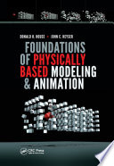

# What is Game Physics
Game Physics is some rules running in the digital world that pretend to be real physics do.
In computer graphics, at lest four field are introduced in now days, which is Rendering, Simulation, Geometry, Animation.
Generally, Physics is in the field of simulation. A Computer Game is a simple simulation scene.
Noted that this parts are not devided - means that when coming with real problems, you need to do this all.

# When Should I Use Physics
In game physics, the main part is game rather than physics. 
Mostly, game physics contains:
1. RigidBodyDynamics
2. DummyBodyDynamics
3. CharacterController
4. RagDollDyanamics
5. ClothSimulation
6. WaterSimulation
7. DeformableSimulation
8. SkeletonDyanmics
9. Vehicle
10. InverseKinematics
11. ParticleSystem
12. ClimateSystem
...

You may have seen this in other part before. Like particle system, which is always introduced in a rendering system. 
Actually, the range of Rendering and Physics is blurry, sodo the Geometry and Simulation. 

Mostly, game physics talking about classical machanics. So when you want your game world simulate like a real macroscopic world did, you need some classical game physics.

Now days, Graphic Phyics Engineer are doing their jobs mostly in Cloth、Water and Deformable Simulations.The power of GPU makes the massive rigidbody dynamics posible. So it also maybe a era of massive rigid dynamics simulation.

But there are many other non-classical game physics engineers doing there job.
Like:
* https://spaceengine.org/ Space Engine
* https://robertsspaceindustries.com/starmap space citizen
* https://www.nomanssky.com/ no mans sky
...
but for now, we are in earth. We need do as a earthman do.

# More Informations
We made a list for some notably game physics paper and talks:
Click to jump:
* [Clothing](./Cloth/main.md)
* [RigidBody](./RigidBody/main.md)
* [SceneQuery](./SceneQuery/main.md)
* [Deformable](./Deformable/main.md)
* [Fluid](./Fluid/main.md)
* [IK](./IK/main.md)
* [Particle](./Particle/main.md)

# Books List
Here are some useful book for you when learning basic physics.
* 
《Foundations of Physically Based Modeling and Animation》

  
